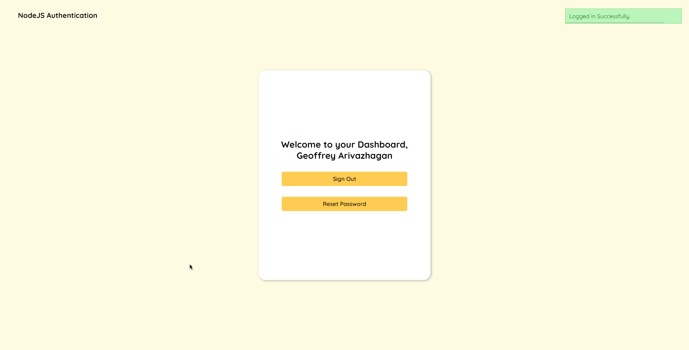

NodeJS Authentication App.

## Table of contents

- [Links](#links)
- [Overview](#overview)
- [Screenshot](#screenshot)
- [Built with](#built-with)
- [To run the app on Local Server](#to-run-the-app-on-local-server)
- [Folder Structure](#folder-structure)
- [Author](#author)

### Links

- Live Site URL: [Live Site URL here](https://nodejs-auth.cyclic.app/)

### Overview

- This is a NodeJS Authentication app with login, register, forget password. Passwords are encrypted in the database using bcrypt. Email verification is done while registering new user and for changing password. Google reCaptcha is added for logging in and while registering new user. This can be used as a Starter code for other Express Nodejs applications.

### Screenshot

### Built with

- NodeJS
- Express
- EJS
- MongoDB
- Mongoose
- SCSS/SASS
- Passport
- Nodemailer

### To run the app on Local Server

- Must have NodeJs and MongoDB installed.
- Install all needed npm dependencies from package.json.
- Get client id, secret and email for implementing Google authentication and Nodemailer and store those in the environment variables.
- Also define jwt secret key, session secret key, assets folder location, mongodb name in the environment variables.
- "npm start" (or) "npm run dev" if you need to compile sass files.
- Server should run on "http://127.0.0.1:8000/".

## Folder Structure

authentication  
├───assets  
│ ├───css  
│ ├───images  
│ ├───js  
│ └───scss  
├───config  
├───mailer  
├───controllers  
├───models  
├───routes  
└───views  

## Author

Geoffrey
